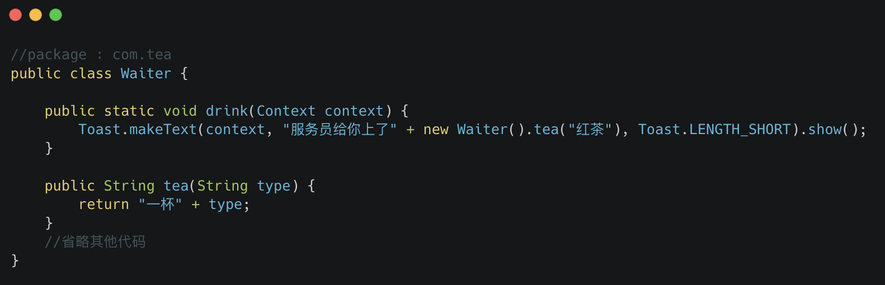
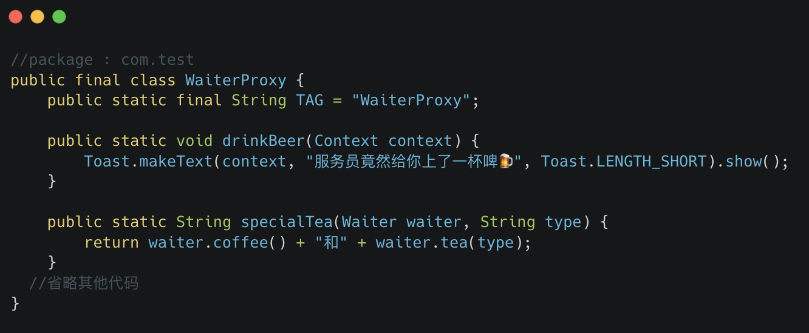
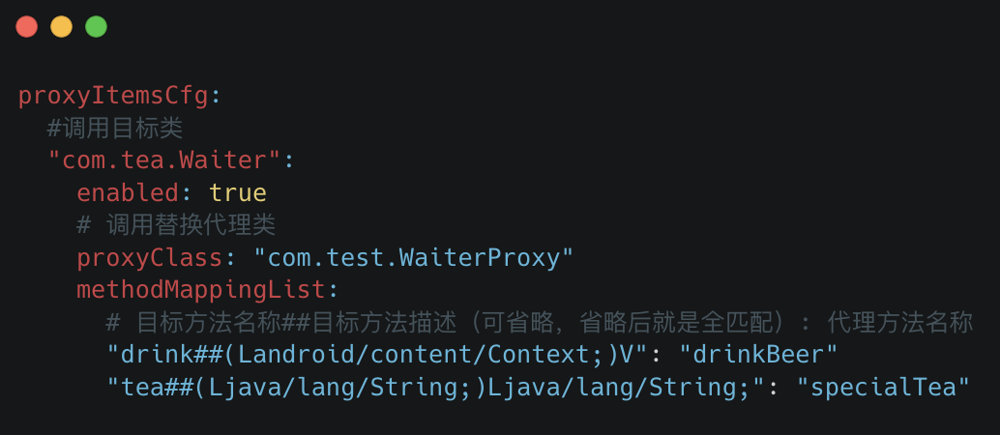
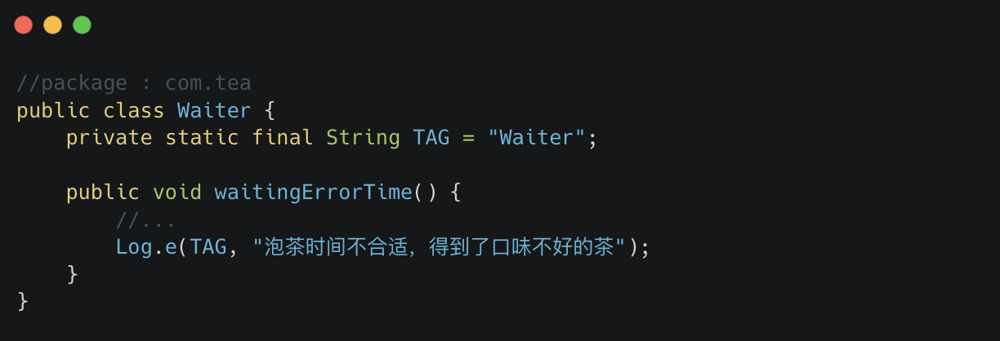
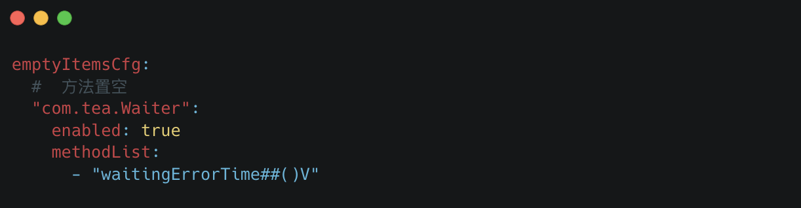
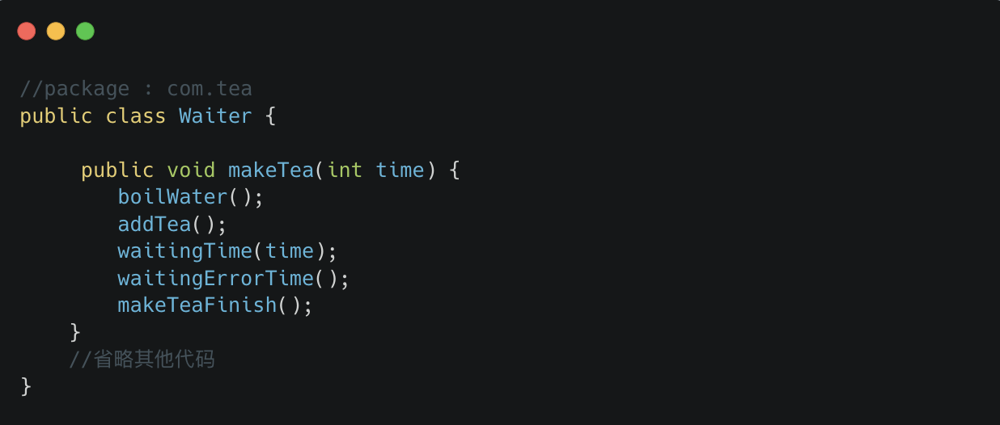
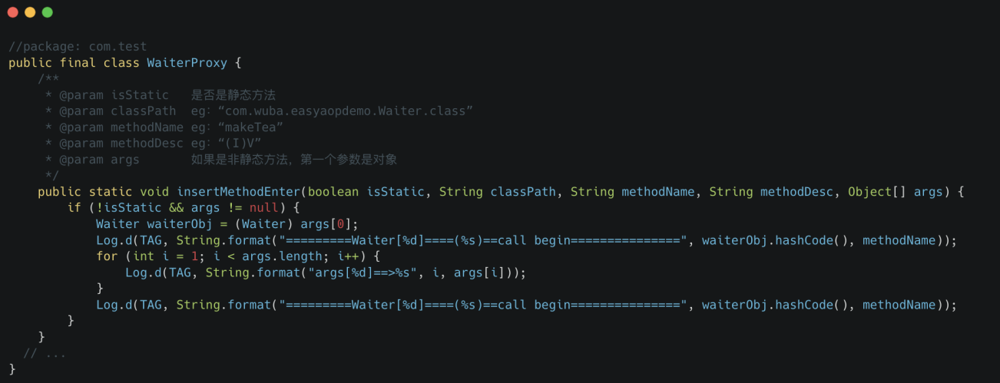
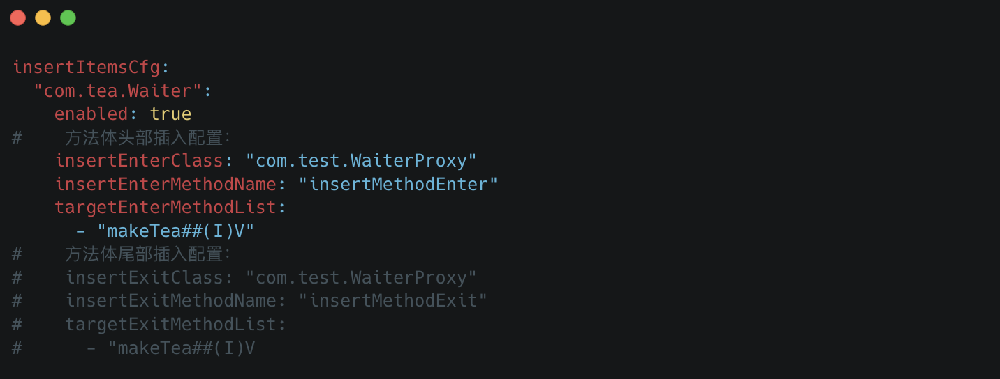
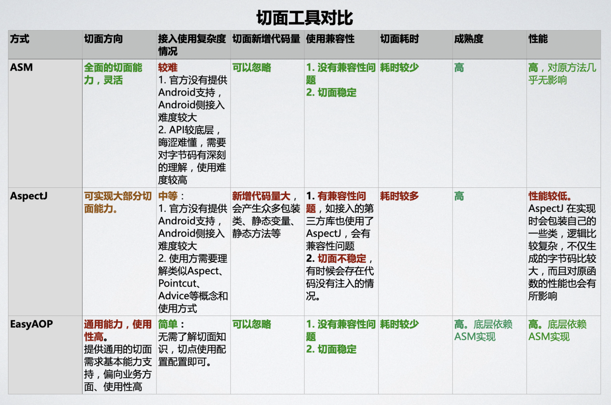

# EasyAOP

[English](./README-en.md)

## EasyAOP是什么
- EasyAOP是基于ASM实现切面通用能力的工具。EasyAOP提供的通用切面能力，可以使用配置文件(`yaml`)方式来配置使用。
- EasyAOP使用不需要开发者了解或理解学习底层的晦涩难懂的切面专业知识，也不需要用相关的切面开发经验。仅根据自己的需求，进行简单配置就能完成相关的切面功能或者能力。
- EasyAOP提供Android gradle Plugin方式，方便Android开发者进行接入使用。

## 为什么要做EasyAOP
1. 我们发现切面需求开发中，使用到的切面通用功能或者能力是有限的，也满足二八原则，既80%的需求只使用到了20%的切面通用功能（能力）
2. 底层的切面知识晦涩难懂，因相关的库更贴近字节码，所以开发者掌握起来难度较大。且切面类的需求较少，投入产出比很差。
3. 开源的切面工具，没有一款既简单好用又稳定可靠的。

## EasyAOP支持的能力

| 能力                                   | 说明                                                         | 用途                                                         | 备注            |
| -------------------------------------- | ------------------------------------------------------------ | ------------------------------------------------------------ | --------------- |
| **方法调用切面代理（替换）**           | 代理替换指定方法调用为自己的方法                             | 1. 控制指定代码的调用逻辑 2. 通过代理方式修复SDK或者系统级方法的bug 3. 其他 | ✅ 1.0版本已实现 |
| **方法体置空**                         | 将指定的方法体内容置空，若该方法有返回值，按照返回值类型，返回默认值 | 1. 屏蔽指定方法逻辑 2. 其他                               | ✅ 1.0版本已实现 |
| **指定方法体，进入、退出插入指定代码** | 对指定方法体，进入或退出插入自己指定的代码                   | 1. 可使用在方法插桩、例如自动化埋点、方法耗时统计等 2. 其他 | ✅ 1.0版本已实现 |
| **添加try catch异常捕获代码段**        | 给指定的方法或者代码添加try catch异常捕获代码段。保证后续代码的正常运行 | 1. 屏蔽某些方法或者代码段的异常，避免异常造成APP崩溃，或者后续代码无法继续执行 2. 其他 | 🗒TODO           |
| **对象替换**                           | 对指定的对象A，使用继承A的B对象进行代码的调用替换            | 1. 全局替换基类的能力，利用java的继承关系，可以植入一层中间层。 2. 其他 | 🗒TODO           |
| **类中添加新方法，或者复写父类方法**   | 1. 类中添加新方法 2. 复写父类方法。                       | 1. 复写父类方法。在一些切面处理中，子类方法中插入或修改逻辑时，需要子类有父类该方法的复现才可以 2. 其他 | 🗒TODO           |
| **方法调用删除**                       | 删除指定的方法调用                                           | 1. 删除方法调用，例如日志清除等                              | 🗒TODO           |
| **其他**                               | ...                                                          | ...                                                          | ...             |

## EasyAOP应用示例

> 说明：下文中在切面示例中提到的“原代码”，是指切面修改之前的代码，在项目中可能是多种形式存在，如AAR、JAR包中的二进制class文件，源码中的java文件等。

### 方法调用切面代理（替换）能力

例如原代码如下：
 

 

我们要对`com.tea.Waiter.class` 中的 `drink`和`tea`方法调用做代理，替换成我们自己`com.test.WaiterProxy.class` 中的`drinkBeer`和`specialTea`。
 

 

在`Android`上接入`EasyAOP`的`gradle plugin`后仅需要在配置文件中添加如下配置即可：
 

 

编译完成，所有关于`com.tea.Waiter.class` 中的 `drink`和`tea`方法调用都会替换成`com.test.WaiterProxy.class` 中的`drinkBeer`和`specialTea`的调用。
 

说明：以上大家注意到，我们方法切面代理能力是支持对象方法和静态方法的代理的。
 

对于静态方法代理来说，提供代理方法和原方法的方法入参是一样的（顺序、类型一样），无需做任何调整。
 

而对于对象方法代理来说，需要注意的是代理方法第一个参数必须是该被代理方法的对象，其他参数依次对照即可，这样做的原因是：很多情况下，代理方法是需要拿到原方法的对象的，需要能够提供进行调用原始方法的能力。

### 方法体置空能力

还是以“服务员煮茶”为例，假如在煮茶流程中有一道错误的流程导致冲泡出来的茶品质很差，要把错误流程去掉。

例如，原代码中：
 

 

要把`com.tea.Water.class` 中 这个`waitingErrorTime` 错误流程方法干掉，接入`EasyAOP plugin`后配置文件写法如下：
 

 

这样就会把`com.tea.Water.class` 中 `waitingErrorTime`方法体内容置空，对于有返回值的方法，方法体置空后默认会返回，返回值类型的默认值，当然返回值也允许用户通过配置设置。

### 指定方法体，进入、退出插入指定代码

例如原方法 `makeTea` 如下：
 

 

如果需要在此方法体开始前插入代码，例如插入方法如下：
 

 

配置为：
 

 
当然方法体尾部插入部分的配置示例也在上面中有提到，使用上也是一样的。

### 其他能力部分
其他能力部分，后续版本陆续支持了，会在对应的使用文档中再做更新。这里就不做介绍了。

## 常见切面工具与EasyAOP的对比

切面工具框架，现在常用的是`ASM`和`AspectJ`，这些框架都是学习、接入使用难度较大，偏全面、底层的框架。`EasyAOP`底层调用和封装的是`ASM`的能力，它提供了面向业务需求的通用能力，仅通过简单配置就能调用。下面是`EasyAOP`和常见切面工具在7个纬度方面的对比：
 

 

从对比上，明显可以看出`EasyAOP`继承了`ASM`好的方面，优化改进了接入使用复杂度，让使用方简单接入，无需了解切面知识就能够快速的进行切面功能需求开发。
 

在上面“为什么要做`EasyAOP`”中也提到了，80%的切面类需求仅仅使用到20%的切面能力，所以我们`EasyAOP`框架 的切面方向是提供面向业务的通用切面能力，而不是全面的、底层的切面能力。
 

## EasyAOP 相关问题

使用EasyAOP之前，请先根据需要阅读相关文档： 

1. [接入指南](./doc/接入指南.md)
2. 示例Sample 参考 [EasyAOP/sample](./sample)
3. [常见问题](./doc/常见问题.md)
4. [日志说明](./doc/日志说明.md)
5. 也可在Issues上寻找和提问问题。
6. `show me the code` 最直接的方式就是看源码了

## 开发者

- [@wswenyue](https://github.com/wswenyue)
- [@stven0king](https://github.com/stven0king)

## 欢迎共建

欢迎同志共建EasyAOP.
[EasyAOP Contributing Guide](./CONTRIBUTING.md).

## 致谢
- [ASM Library](https://gitlab.ow2.org/asm/asm)

## 许可协议

EasyAOP 项目基于[BSD](./LICENSE.txt)协议开源.
