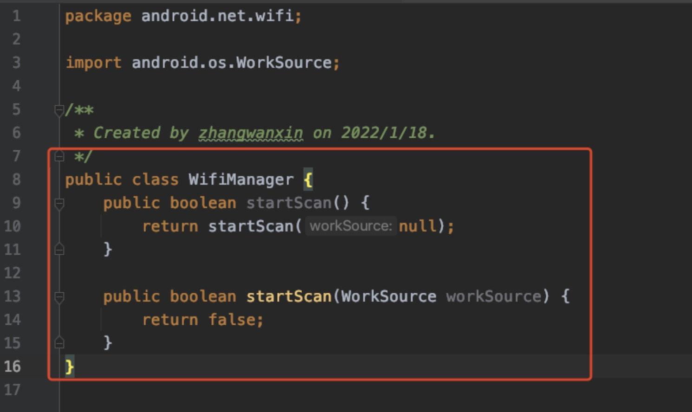
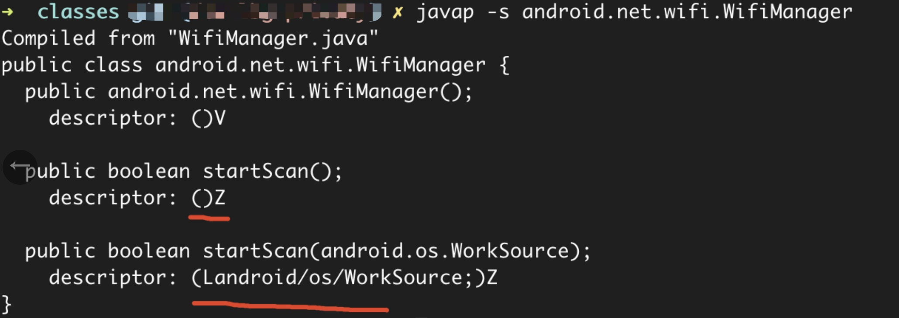

# 常见问题说明

## 方法代理中，代理静态、非静态方法有什么差异

1. 提供的代理方法，都必须是静态方法。
2. 被代理的方法，和代理方法的参数必须是一一对应的
3. 被代理的方法，如果是非静态方法（对象方法），那么提供的对应代理方法的第一个参数必须是该被代理方法的对象，其他参数依次对照即可。

## 配置方法时为什么要加方法描述

例如要代理WifiManager的startScan方法，而startScan方法是有两个重写的情况:`public boolean startScan();`
和`public boolean startScan(android.os.WorkSource);`<br/>
那么现在我有两种选择：<br/>

1. 代理全部的重写方法，由于参数不一致，所以我需要在代理类中实现所有的`startScan`参数的代理方法，不能遗漏，否则切面修改后运行会报错。
2. 代理其中某个方法，那么目标方法在配置的时候就需要加上对应的方法描述，如下我代理其中一个方法`public boolean startScan(android.os.WorkSource);`
   的配置

```
// 代理Hooker列表
hookerItems {
    //要代理替换的类【目标类、被代理类】
    "android/net/wifi/WifiManager" {
        targetHookMethodsMap = [
                //"【目标方法名称#目标方法描述;(如不加描述，是所有该类该方法都会被处理)】":"【代理方法名称】"
                "startScan#(Landroid/os/WorkSource;)Z": "startScanProxy",
        ]
    }
}
```

## 方法描述如何获取

这里以WifiManager为例，假如你需要代理这两个重名方法中的一个，需要加方法描述的。

1. 先新建一个和系统一样的类，类名和路径一样。把方法拷过来（方法体不需要）。
   
2. 编译
3. 在编译后的路径目录下（/app/build/intermediates/javac/debug/classes）执行`javap -s android.net.wifi.WifiManager`
   
4. 拷贝`descriptor`

## 如何在配置中使用匹配（过滤）

配置中目前提供了黑白名单来帮助更好的匹配和减小切面修改的粒度，降低切面修改带来的测试复杂度。 过滤目前提供了公共过滤和配置切面子项过滤

### 公共过滤逻辑也称Root层过滤，优先级最高。提供了以下方式

- 白名单：onlyClazz(仅处理Class列表)；onlyJars(仅处理Jar包列表)
- 黑名单：skipClazz(跳过处理Class列表)；skipJars(跳过处理Jar包列表)

需要注意的是，黑白名单是互斥的，如果配置了白名单，黑名单将失效。

### 切面子项过滤，提供了：

- 白名单：onlyClazz(仅处理Class列表)
- 黑名单：skipClazz(跳过处理Class列表)

需要注意的是，黑白名单是互斥的，如果配置了白名单，黑名单将失效，

### 在过滤中使用正则 或 全匹配

为了区分使用的是正则还是字符串全匹配，正则需要加上前缀"`_regex_`"区分，字符串全匹配则不需要。 例如：

```yaml
skipClazz:
  # 正则匹配R文件
  - _regex_^\S+\.R\.class$
  # 字符串全匹配 com.XX.class
  - com.XX.class

```

### 为啥过滤了jar包不生效？

jar包过滤目前是过滤jar包的名称。<br/>
Android gradle 编译时，会根据插件`apply`的先后顺序对jar 包进行流转处理，<br/>
排在前面的插件在处理之后，jar包的名称有可能会被改变，例如变成1.jar等，这样根据名称就不能对jar进行过滤。<br/>
所以为了避免此类问题，建议将EasyAOP 插件的`apply`放在最前面，例如在`apply plugin: 'com.android.application'` 之后等

## 方法体进入退出插入指定代码，插入方法调用的方法入参必须按照要求,入参顺序和类型如下。

```
/**
  * @param isStatic   是否是静态方法
  * @param classPath  eg：“com.wuba.easyaopdemo.Waiter.class”
  * @param methodName eg：“makeTea”
  * @param methodDesc eg：“(I)V”
  * @param args       如果是非静态方法，第一个参数是对象
  */
public static void yourMethodName(boolean isStatic, String classPath, String methodName, String methodDesc, Object[] args) {
  if (!isStatic && args != null) {
      Waiter waiterObj = (Waiter) args[0];
      Log.d(TAG, String.format("=========Waiter[%d]====(%s)==call begin===============", waiterObj.hashCode(), methodName));
      for (int i = 1; i < args.length; i++) {
          Log.d(TAG, String.format("args[%d]==>%s", i, args[i]));
      }
      Log.d(TAG, String.format("=========Waiter[%d]====(%s)==call begin===============", waiterObj.hashCode(), methodName));
  }
}

```

## 内部类代理如何写

示例如下：

```yaml
proxyItemsCfg:
  # 系统Settings文件相关方法，例如Android_id
  android.provider.Settings$System:
    enabled: true
    proxyClass: "your-proxy-class"
    methodMappingList:
      "getString": "getString"

  android.provider.Settings$Secure:
    enabled: true
    proxyClass: "your-proxy-class"
    methodMappingList:
      "getString": "getString"
```

## 方法体置空-默认值说明
**方法体置空**后，有时候我们需要注意下方法的返回值。目前版本还不支持自定义的返回值（后续会添加自定义返回值），都是进行的默认处理。

| 返回数据类型|默认值|
|:--|:--|
|void|void|
|byte|0|
|short|0|
|char|0|
|int|0|
|long|0|
|float|0|
|double|0|
|boolean|false|
|java.lang.String|""|
|java.util.List|java.util.Collections#emptyList|
|java.util.Collection|java.util.Collections#emptyList|
|java.util.Set|java.util.Collections#emptySet|
|java.util.Map|java.util.HashMap#<init>|
|java.util.Map|java.util.HashMap#<init>|
|default|null|