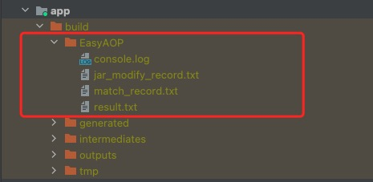

# EasyAOP 执行产生的各类日志说明

## 日志位置

所有日志在`build/EasyAOP/` 文件夹下,<br/>



## `console.log`总输出日志

所有的日志内容都会输入到这个文件中，日志最详细，内容较大，主要用于排查 EasyAOP 内部执行问题。接入方一般不需要看这个文件。

## `jar_modify_record.txt` 被EasyAOP修改的jar包记录

jar包被EasyAOP切面修改后，就会记录到该文件中，内容格式如下：<br/>
`原jar文件名称##处理后生成的jar包绝对路径`

```log
*****************begin*****************
jetified-constraintlayout-core-1.0.2.jar##/Users/XXX/EasyAOPDemo/app/build/intermediates/transforms/EasyAOPTransform/debug/38.jar
lifecycle-common-2.1.0.jar##/Users/XXX/EasyAOPDemo/app/build/intermediates/transforms/EasyAOPTransform/debug/34.jar
versionedparcelable-1.1.1-runtime.jar##/Users/XXX/EasyAOPDemo/app/build/intermediates/transforms/EasyAOPTransform/debug/22.jar
...
*****************close*****************

```

## `match_record.txt` 在处理过程过滤匹配记录

使用过程中有不少问题是过滤的问题。<br/>
例如正则写的不对，黑白名单用的不对等，发生此类问题，均不好排查。<br/>
所以在EasyAOP处理过程中对于过滤匹配逻辑均加了日志记录，方便看配置的过滤生效情况。
<p>
文件内容格式如下：

```log
*****************begin*****************
[skip:Jar]^\S+kotlin-stdlib-(\d+\.)+jar$=>jetified-kotlin-stdlib-1.5.30.jar<=Root
[skip:Source]^\S+\.R\$interpolator\.class$=>com.google.android.material.R$interpolator.class<=Root
[skip:Source]proxyClass=>com.wuba.proxy.ReflectProxy.class<=ProxyClass
[only:Source]com.wuba.easyaopdemo.ui.main.MainFragment.class=>com.wuba.easyaopdemo.ui.main.MainFragment.class<=Proxy(java.lang.reflect.Method.class)
...
*****************close*****************
```

### 关键词说明

- `[skip:Jar]`/`[skip:Source]`/`[only:Source]` : skip表示命中黑名单; only表示命中了白名单; Jar 表示命中的是Jar包;
  Source表示命中的是class文件
- `Root` 表示是最外层（Root层）配置，配置的过滤条件

## `result.txt` 是切面处理结果记录

使用方，主要是看这个文件，里面记录了哪些类，的那些方法被修改了
<p>
文件内容格式如下：

```log
*****************begin*****************
ProxyCodeNodeHandler_Proxy	:androidx.constraintlayout.motion.utils.ViewSpline$ProgressSet.class##setProperty##(Landroid/view/View;F)V	(JAR::constraintlayout-2.1.2-runtime.jar=>1.jar)
ProxyCodeNodeHandler_Proxy		:java.lang.reflect.Method.invoke()##(Ljava/lang/Object;[Ljava/lang/Object;)Ljava/lang/Object;==>com.wuba.proxy.ReflectProxy.invoke()##(Ljava/lang/reflect/Method;Ljava/lang/Object;[Ljava/lang/Object;)Ljava/lang/Object;
ProxyCodeNodeHandler_Proxy	:com.wuba.easyaopdemo.ui.main.MainFragment.class##onClick##(Landroid/view/View;)V	(SOURCE::MainFragment.class)
ProxyCodeNodeHandler_Proxy		:com.wuba.easyaopdemo.Waiter.drink()##(Landroid/content/Context;)V==>com.wuba.proxy.WaiterProxy.drinkBeer()##(Landroid/content/Context;)V
EmptyCodeNodeHandler_Empty	:com.wuba.easyaopdemo.Waiter##waitingErrorTime##()V	(SOURCE::Waiter.class)
ProxyCodeNodeHandler_Proxy	:com.wuba.easyaopdemo.Waiter.class##drinkTea##(Landroid/content/Context;)V	(SOURCE::Waiter.class)
ProxyCodeNodeHandler_Proxy		:com.wuba.easyaopdemo.Waiter.tea()##(Ljava/lang/String;)Ljava/lang/String;==>com.wuba.proxy.WaiterProxy.specialTea()##(Lcom/wuba/easyaopdemo/Waiter;Ljava/lang/String;)Ljava/lang/String;
InsertMethodCodeHandler_Insert_Exit		:==>com/wuba/proxy/WaiterProxy.insertMethodExit()#(ZLjava/lang/String;Ljava/lang/String;Ljava/lang/String;[Ljava/lang/Object;)V
InsertMethodCodeHandler_Insert_Exit	:com.wuba.easyaopdemo.Waiter.makeTea()#(I)V	(SOURCE::Waiter.class)
InsertMethodCodeHandler_Insert_Enter		:==>com/wuba/proxy/WaiterProxy.insertMethodEnter()#(ZLjava/lang/String;Ljava/lang/String;Ljava/lang/String;[Ljava/lang/Object;)V
InsertMethodCodeHandler_Insert_Enter	:com.wuba.easyaopdemo.Waiter.makeTea()#(I)V	(SOURCE::Waiter.class)
...
*****************close*****************

```

### 格式说明

#### 方法代理示例说明

```
ProxyCodeNodeHandler_Proxy	:androidx.constraintlayout.motion.utils.ViewSpline$ProgressSet.class##setProperty##(Landroid/view/View;F)V	(JAR::constraintlayout-2.1.2-runtime.jar=>1.jar)
ProxyCodeNodeHandler_Proxy		:java.lang.reflect.Method.invoke()##(Ljava/lang/Object;[Ljava/lang/Object;)Ljava/lang/Object;==>com.wuba.proxy.ReflectProxy.invoke()##(Ljava/lang/reflect/Method;Ljava/lang/Object;[Ljava/lang/Object;)Ljava/lang/Object;
...
```

`ProxyCodeNodeHandler_Proxy`：表示是方法调用代理<br/>

示例中结果说明：代理了`(JAR::constraintlayout-2.1.2-runtime.jar=>1.jar)`
Jar包（原jar是constraintlayout-2.1.2-runtime.jar，处理后生成是1.jar）
`androidx.constraintlayout.motion.utils.ViewSpline$ProgressSet.class` class 文件中 `setProperty`
方法（方法描述是`(Landroid/view/View;F)V`），方法体中的
`java.lang.reflect.Method.invoke()`
方法调用（方法描述`(Ljava/lang/Object;[Ljava/lang/Object;)Ljava/lang/Object;`
），代理成`com.wuba.proxy.ReflectProxy.invoke()`
（方法描述`(Ljava/lang/reflect/Method;Ljava/lang/Object;[Ljava/lang/Object;)Ljava/lang/Object;`）

#### 方法体置空示例说明

```
EmptyCodeNodeHandler_Empty	:com.wuba.easyaopdemo.Waiter##waitingErrorTime##()V	(SOURCE::Waiter.class)
```

`EmptyCodeNodeHandler_Empty`：表示是方法体置空<br/>
示例结果说明了：在Waiter.class类中（`SOURCE`表示非Jar包），方法`com.wuba.easyaopdemo.Waiter.waitingErrorTime()`
（方法描述为`()V`）被成功置空了。

#### 方法体进入退出插入指定方法调用

```
InsertMethodCodeHandler_Insert_Exit :com.wuba.easyaopdemo.Waiter.makeTea()#(I)V	(SOURCE::Waiter.class)
InsertMethodCodeHandler_Insert_Exit   :==>com/wuba/proxy/WaiterProxy.insertMethodExit()#(ZLjava/lang/String;Ljava/lang/String;Ljava/lang/String;[Ljava/lang/Object;)V
InsertMethodCodeHandler_Insert_Enter  
InsertMethodCodeHandler_Insert_Enter    :==>com/wuba/proxy/WaiterProxy.insertMethodEnter()#(ZLjava/lang/String;Ljava/lang/String;Ljava/lang/String;[Ljava/lang/Object;)V
...
```


- `InsertMethodCodeHandler_Insert_Exit`:表示方法体退出时插入代码
    - `:com.wuba.easyaopdemo.Waiter.makeTea()#(I)V    (SOURCE::Waiter.class)` ：表示在那个方法体中插入
    - `:==>com/wuba/proxy/WaiterProxy.insertMethodExit()#(ZLjava/lang/String;Ljava/lang/String;Ljava/lang/String;[Ljava/lang/Object;)V`
      ：表示插入内容是什么
- `InsertMethodCodeHandler_Insert_Enter`:表示方法体进入时插入代码
  - `:com.wuba.easyaopdemo.Waiter.makeTea()#(I)V	(SOURCE::Waiter.class)`：表示在那个方法体中插入
  - `:==>com/wuba/proxy/WaiterProxy.insertMethodEnter()#(ZLjava/lang/String;Ljava/lang/String;Ljava/lang/String;[Ljava/lang/Object;)V`：表示插入内容是什么
